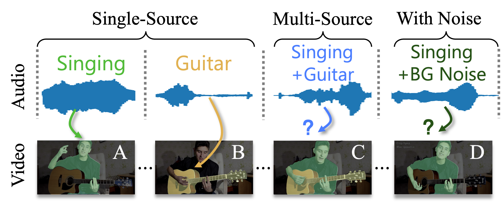

<p align="center"></p>

> [**Towards Robust Audiovisual Segmentation in Complex Environments with Quantization-based Semantic Decomposition**](https://arxiv.org/pdf/2310.00132.pdf)
>
> Xiang Li, Jinglu Wang, Xiaohao Xu, Xiulian Peng, Rita Singh, Yan Lu, Bhiksha Raj
---

## Abstract

Audiovisual segmentation (AVS) is a challenging task that aims to segment visual objects in videos according to their associated acoustic cues. 
With multiple sound sources and background disturbances involved, establishing robust correspondences between audio and visual contents poses unique challenges due to (1) complex entanglement across sound sources and (2) frequent changes in the occurrence of distinct sound events. 
Assuming sound events occur independently, the multi-source semantic space can be represented as the Cartesian product of single-source sub-spaces.
We are motivated to decompose the multi-source audio semantics into single-source semantics for more effective interactions with visual content.
We propose a semantic decomposition method based on product quantization, where the multi-source semantics can be decomposed and represented by several disentangled and noise-suppressed single-source semantics. 
Furthermore, we introduce a global-to-local quantization mechanism, which distills knowledge from stable global (clip-level) features into local (frame-level) ones, to handle frequent changes in audio semantics.
Extensive experiments demonstrate that our semantically decomposed audio representation significantly improves AVS performance, \eg, +21.2\% mIoU on the challenging AVS-Semantic benchmark with ResNet50 backbone.


# Updates
- **(2023-12-07)** Repo created.

## Citation

```
@article{li2023rethinking,
  title={Rethinking Audiovisual Segmentation with Semantic Quantization and Decomposition},
  author={Li, Xiang and Wang, Jinglu and Xu, Xiaohao and Peng, Xiulian and Singh, Rita and Lu, Yan and Raj, Bhiksha},
  journal={arXiv preprint arXiv:2310.00132},
  year={2023}
}
```
